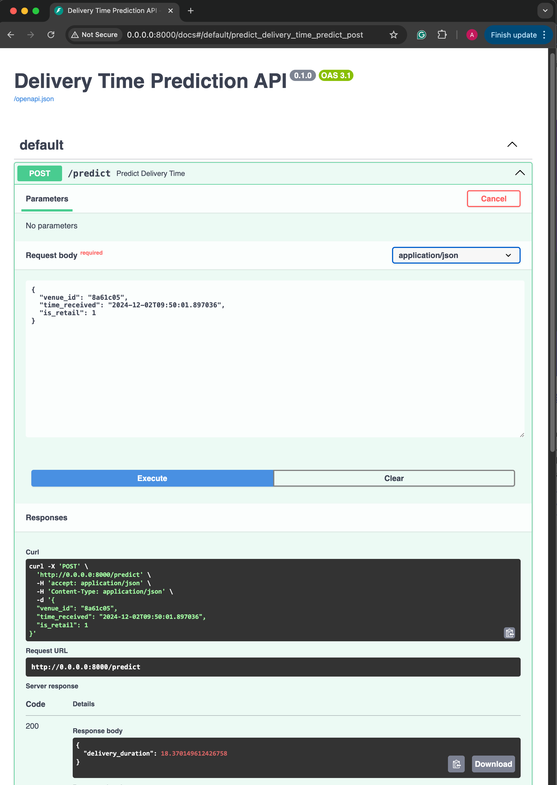

# Delivery Time Prediction Inference Service

## Overview

This project implements a RESTful inference service to predict delivery times for orders based on provided order information and venue characteristics. The service is built using FastAPI and employs Redis for caching venue preparation times. The model used is an XGBoost regressor trained on relevant features.

---
Full description of the task:

You are given a toy dataset, a model training script and a trained model checkpoint. The dataset contains orders information and their corresponding delivery time.
The training script (i) takes the two datasets (orders_data.csv - dataset which contains orders information and venue_preparation.csv - a dataset with some characteristics of the venue) and (ii) trains an XGBoost model using the following features: is_retail, avg_preparation_time and the hour of day the order was received. You do not need to run this script, it is here to provide information on how the attached model was trained.
Your goal is to implement the remaining essential step: serving the model in  for real time inference.

Sub-tasks:
- Implement an inference service: REST-service that (i) takes in relevant information about an order in the input request (features from orders_data.csv file), (ii) validates the input request, (iii) adds features from a cache (features from venue_preparation.csv), (iv) does a prediction using these features and the model artifact provided in the zip file and (v) returns the predicted delivery time for this order.
- Inference service and cache are packed in docker containers and composed together.
- Assume that this model will be used to predict delivery times in real time, so choose the model and frameworks accordingly.
- Add tests (full coverage isn't mandatory)
- Add a README that includes information about how to run the app, an explanation of the end-to-end system, future improvements to the solution and examples for the service request and response.

## Project Structure

```
inference_service
├── Dockerfile
├── README.md
├── app
│   ├── __init__.py
│   ├── cache.py
│   ├── main.py
│   ├── model.py
│   └── schemas.py
├── data
│   ├── _orders_data.csv
│   └── _venue_preparation.csv
├── docker-compose.yml
├── model_artifact
│   └── _model_artifact.json
├── requirements.txt
└── tests
    ├── __init__.py
    └── test_main.py
```

## Getting Started

### Prerequisites

- [Python](https://www.python.org/) 3.11
- [Docker](https://www.docker.com/get-started)
- [Docker Compose](https://docs.docker.com/compose/install/)

### Running the Application

2. **Build and Start the Containers**

    ```bash
    cd inference_service
    docker-compose up --build
    ```
    This command builds the Docker images and starts both the Redis cache and the inference service.

3. **Access the API**

    The API will be available at http://localhost:8000.

    API Documentation: Visit http://localhost:8000/docs for interactive Swagger UI documentation.

4. **Example**
    
    Request

    ```bash
    curl -X 'POST' \
    'http://0.0.0.0:8000/predict' \
    -H 'accept: application/json' \
    -H 'Content-Type: application/json' \
    -d '{
    "venue_id": "8a61c05",
    "time_received": "2024-12-02T09:50:01.897036",
    "is_retail": 1
    }'
    ```

    Response

    ```json
    {
        "delivery_duration": 18.370149612426758
    }
    ```

    Example of UI

    

### Running Tests

Ensure you have Python and pytest installed.

```bash
python -m venv venv
source venv/bin/activate
pip install -r requirements.txt
```
Run Tests

```bash
pytest
```

## System Architecture

- FastAPI: Handles incoming REST API requests, validates input, retrieves additional features from Redis, and performs predictions using the XGBoost model.
- Redis: Stores `avg_preparation_time` for each `venue_id` to enable quick retrieval during inference.
- Docker Compose: Orchestrates both services, ensuring they communicate seamlessly.

## Future Improvements

- Authentication: Implement API authentication and authorization to secure the service.
- Logging and Monitoring: Integrate logging and monitoring (e.g., Prometheus, Grafana) for better observability.
- Scalability: Deploy on Kubernetes for horizontal scaling and high availability.
- Error Handling: Enhance error handling with more specific exceptions and retries.
- Model Versioning: Implement model versioning to manage multiple models and seamless updates.
- CI/CD Pipeline: Set up continuous integration and deployment pipelines for automated testing and deployment.

## Notes on Technology Choices

For this assignment, FastAPI paired with Redis offers a simpler and more straightforward solution for real time predictions. However, for production environments requiring scalability and advanced features, adopting Kubernetes would be beneficial.